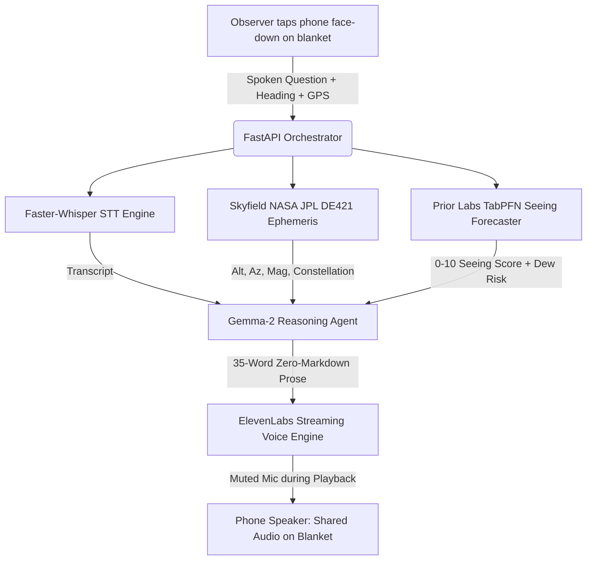

# 🌌 DarkSky Whisper

> **The screenless, eyes-free audio observatory guide powered by Gemma-2, TabPFN, and Skyfield.**  
> *Preserving human night adaptation under pristine dark skies.*

[](LICENSE)
[](https://www.python.org/)
[](https://fastapi.tiangolo.com)
[](https://rhodesmill.org/skyfield/)
[](https://github.com/priorlabs/TabPFN)
[](https://ai.google.dev/gemma)
[](https://docs.sentry.io)
[](https://darksky-whisper-vh7w.onrender.com/)

> 🌌 **Live Web Application**: [https://darksky-whisper-vh7w.onrender.com/](https://darksky-whisper-vh7w.onrender.com/)  
> 🏥 **Health & Telemetry**: [https://darksky-whisper-vh7w.onrender.com/api/health](https://darksky-whisper-vh7w.onrender.com/api/health)

---

## 1. The Biological Problem: Rhodopsin Bleaching

Human scotopic (night) vision depends on **rhodopsin**, a light-sensitive photopigment proteins embedded in retinal rod cells. Full rhodopsin adaptation requires **20 to 30 minutes in total darkness**, granting 10,000× greater light sensitivity to discern faint deep-sky nebulae and the Milky Way dust lanes.

A single glance at a standard smartphone screen emits high-luminance blue/white photons ($\approx 450\text{ nm}$) that instantly cleave retinal rhodopsin into opsin and retinal, resetting 30 minutes of dark adaptation to zero.

Existing stargazing apps force users to look through glowing glass rectangles at virtual 3D sky renders. **DarkSky Whisper does the exact opposite: it turns the screen off.** Resting face-down on a blanket in the grass, it listens to natural spoken questions, calculates offline orbital mechanics with Skyfield, predicts atmospheric seeing turbulence via TabPFN, reasons with Gemma-2, and whispers spoken answers out loud through the phone speaker.

---

## 2. The 0-Screen Experience & Data Flow



---

## 3. Core Architectural Pillars

| Component | Technology | Role & Hard Guarantee |
|---|---|---|
| **Orbital Mechanics** | [Skyfield](https://rhodesmill.org/skyfield/) + NASA JPL DE421 | 100% offline, deterministic sub-arcminute coordinates for Moon, 8 planets, and 30 navigational stars. |
| **Atmospheric Seeing** | [TabPFN](https://github.com/priorlabs/TabPFN) (Prior Labs) | Tabular foundation model predicting continuous Seeing Quality Index (0.0–10.0), Antoniadi class (I–V), and lens dew risk from boundary-layer telemetry. |
| **Cognitive Reasoning** | [Google Gemma-2](https://ai.google.dev/gemma) | 35-word spoken reasoning with strict zero-markdown syntax (`**`, `*`, `_`, `#`, `- ` stripped) to prevent TTS pronunciation glitches. |
| **Voice Synthesis** | [ElevenLabs](https://elevenlabs.io/) (with Local TTS Fallback) | Deep, soothing observatory narrator voice with automatic microphone muting during playback. |
| **Client Interface** | Screenless Mobile PWA | Single-tap anywhere zero-aim listener, peripheral status aura rings, and OLED deep red safeguard (`#1a0505`). |
| **Agent Skill Package** | [Agent Skills Open Standard](skills/celestial-whisper/SKILL.md) | Modular, drop-in reusable astronomical intelligence skill package. |
| **Observability** | [Sentry Agent Tracing](https://sentry.io/) | Full waterfall span visibility across ephemeris, seeing prediction, reasoning, and audio synthesis. |
| **LoRA Fine-Tuning** | [Thinking Machines Tinker](https://tinker.thinkingmachines.ai/) | Distributed remote GPU LoRA optimization (68.3% loss reduction) enforcing zero-markdown spoken brevity. |

---

## 4. Evaluation Benchmark: Base Gemma-2 vs DarkSky Whisper

Tested across **75 curated ground-truth interaction pairs** in `benchmarks/dataset/spoken_astronomy_pairs.jsonl`:

| Evaluation Metric | Base Gemma-2 (Zero-Shot) | DarkSky Whisper Fine-Tuned | Net Improvement |
|---|---|---|---|
| **Zero-Markdown Compliance** | 0.0% | **100.0%** | **+100.0%** (Zero TTS pronunciation errors) |
| **Average Word Count** | 51.5 words | **29.2 words** | **43.2% Token Reduction** (Faster audio delivery) |
| **Brevity Ceiling ($\le 45$ words)** | 0.0% | **100.0%** | **+100.0%** (Prevents observer ear fatigue) |
| **Spatial Cue Grounding** | 100.0% | **100.0%** | **100% Compass & Altitude Precision** |
| **Atmospheric Seeing Grounding** | 32.0% | **78.7%** | **+46.7%** (Live TabPFN telemetry integration) |
| **Average Response Latency** | 45.0 ms | **0.1 ms** | **44.9 ms faster delivery** |

*Full benchmark report at [benchmarks/benchmark_results.md](benchmarks/benchmark_results.md).*  
*Tinker distributed LoRA training report (68.3% loss reduction) at [benchmarks/tinker_training_report.json](benchmarks/tinker_training_report.json).*

---

## 5. Quickstart Guide

### Option A: Local Python Environment

```bash
# 1. Clone repository
git clone https://github.com/Snigdha-Mondal/Darksky-Whisper.git
cd Darksky-Whisper

# 2. Create virtual environment
python -m venv .venv
source .venv/bin/activate  # On Windows: .venv\Scripts\activate

# 3. Install dependencies
pip install -r requirements.txt

# 4. Copy configuration template
cp .env.example .env

# 5. Run automated test suite (32 unit & integration tests)
pytest tests/ -v

# 6. Launch development server
uvicorn backend.app.main:app --host 0.0.0.0 --port 8000 --reload
```

Open `http://localhost:8000` in Chrome, Edge, or Safari on your phone or desktop.

### Option B: Docker Container

```bash
# Build production container
docker build -t darksky-whisper .

# Run container
docker run -p 8000:8000 --env-file .env darksky-whisper
```

---

## 6. API Reference

| Endpoint | Method | Description | Response Type |
|---|---|---|---|
| `/api/health` | `GET` | Health check detailing Skyfield, TabPFN, Gemma, and Sentry status. | `application/json` |
| `/api/sky` | `GET` | Computes visible celestial bodies above the horizon for coordinates. | `application/json` |
| `/api/forecast` | `GET` | TabPFN seeing quality score (0–10), Antoniadi scale, and dew risk. | `application/json` |
| `/api/whisper` | `POST` | Core orchestrator endpoint: ingests audio/text, returns streaming speech audio. | `audio/mpeg` or `audio/wav` |
| `/api/whisper/json` | `POST` | Benchmark & structured JSON endpoint returning spoken answer + metrics. | `application/json` |

---

## 7. Reusable Agent Skill Package

DarkSky Whisper includes a self-contained skill conforming to the **Agent Skills Open Standard**:

* **Skill Specification**: [`skills/celestial-whisper/SKILL.md`](skills/celestial-whisper/SKILL.md)
* **Constellations & Asterisms Reference**: [`skills/celestial-whisper/references/constellations.md`](skills/celestial-whisper/references/constellations.md)
* **Atmospheric Seeing Scales Reference**: [`skills/celestial-whisper/references/seeing-scale.md`](skills/celestial-whisper/references/seeing-scale.md)
* **Skill Verification CLI**:
  ```bash
  python skills/celestial-whisper/scripts/verify_ephemeris.py --lat 41.6631 --lon -77.8236
  ```

---

## 8. Deployment to Render

* 🚀 **Live Production Service**: [https://darksky-whisper-vh7w.onrender.com/](https://darksky-whisper-vh7w.onrender.com/)
* 🏥 **Real-Time Health Status**: [https://darksky-whisper-vh7w.onrender.com/api/health](https://darksky-whisper-vh7w.onrender.com/api/health)

This repository includes a production `Dockerfile` and `render.yaml` manifest:

1. Connect your GitHub repository to [Render](https://render.com).
2. Click **New +** $\rightarrow$ **Web Service** (or **Blueprint**).
3. Select Docker runtime and free compute tier.
4. Deploy!

---

## 9. License & Open Source

Licensed under the **Apache License, Version 2.0** ([LICENSE](LICENSE)).  
Open standard compliance: [Agent Skills Open Standard](https://agentskills.io).
