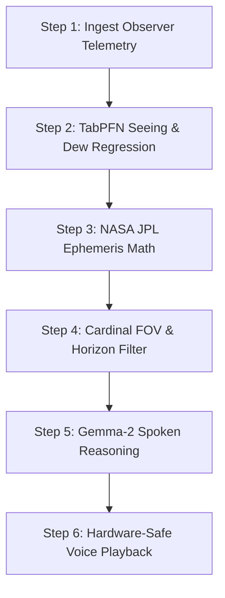

# Celestial Whisper Skill

An Agent Skills Open Standard implementation for screenless, hands-free astronomical guidance under dark skies. This skill preserves human dark adaptation (scotopic vision and retinal rhodopsin) by delivering precise celestial ephemeris and atmospheric seeing intelligence entirely through calm spoken prose.

---

## 1. Capabilities & Purpose

* **Deterministic Offline Ephemeris**: Computes high-precision coordinates (Altitude, Azimuth, Apparent Magnitude, Constellation) for the Sun, Moon, 8 planets, and 30 navigational stars using NASA JPL DE421 ephemeris.
* **Atmospheric Seeing Regression**: Estimates turbulent seeing quality (0.0 to 10.0 scale, Antoniadi classes I–V) and dew condensation hazards using meteorological boundary-layer telemetry and Prior Labs TabPFN foundation models.
* **Eyes-Free Spatial Guidance**: Translates spherical sky coordinates into natural human reference frames ("35 degrees high in the east", "overhead near zenith") with compass-heading field-of-view gating.
* **Strict Zero-Markdown Spoken Prose**: Formats answers into 35-word natural spoken English strictly stripped of asterisks, bolding, hashes, bullets, or numerals that distort text-to-speech audio engines.

---

## 2. Standard Operating Procedure

When invoked to guide an observer in the field, execute the following six-step pipeline:



### Step 1: Ingest Observer Telemetry
Obtain the observer's geographic position and orientation:
- **Latitude & Longitude** (decimal degrees, WGS84).
- **Elevation** (meters above sea level; default to 0 if unknown).
- **UTC Timestamp** (accurate to seconds).
- **Compass Heading** (degrees azimuth 0°–360°; optional, defaults to 360° omnidirectional panorama).

### Step 2: TabPFN Seeing & Dew Regression
Query local meteorological boundary-layer parameters (temperature, dew point depression, relative humidity, wind speed at 10m/100m, wind shear, cloud cover) and evaluate:
1. **Seeing Quality Score**: Continuous index from 0.0 (turbulent/boiling) to 10.0 (pristine/space-like).
2. **Antoniadi Scale**: Classify into standard astronomical stability bands (I to V).
3. **Dew Point Risk**: Determine if lens condensation hazard is Low, Moderate, High, or Critical.
4. **Optimal Window**: Identify the multi-hour window with highest seeing stability.

### Step 3: NASA JPL Ephemeris Calculation
Compute true topocentric apparent positions using Skyfield and DE421:
- Calculate Altitude above the horizon (degrees) and Azimuth (degrees east of north).
- Calculate Moon illumination percentage and current lunar phase.
- Map bodies to standard IAU constellations.

### Step 4: Cardinal FOV & Horizon Filtering
Filter raw ephemeris targets against physical observational constraints:
- **Horizon Filter**: Discard any celestial body where $\text{Altitude} \le 0^\circ$.
- **Field of View Filter**: If observer compass heading $\theta$ is provided, select bodies within $[\theta - 45^\circ, \theta + 45^\circ]$ (taking $360^\circ$ wraparound into account).
- **Apparent Magnitude Sorting**: Sort remaining targets by brightness (lower magnitude = brighter).

### Step 5: Synthesize Zero-Markdown Spoken Prose
Synthesize the final spoken sentence using Gemma-2 reasoning rules:
1. Answer the user's specific celestial query directly in the opening phrase.
2. Provide immediate spatial cues: specify cardinal direction (North, East, South, West) and altitude in degrees.
3. Incorporate atmospheric stability: if seeing is pristine ($\ge 8.0$), describe steady glow; if seeing is turbulent ($< 5.0$), note atmospheric boundary twinkling.
4. If dew risk is critical, append an alert to activate lens heaters.
5. Limit entire spoken response to **35–45 words** (maximum 3 spoken sentences).

### Step 6: Hardware-Safe Voice Synthesis
Stream spoken answer through the audio engine:
- If ElevenLabs API key is configured, stream calm low-pitch narrator audio (`audio/mpeg`).
- If operating offline, stream local acoustic cue and utilize client-side Web Speech API.
- Suppress microphone input during audio output to prevent acoustic feedback loops.

---

## 3. Hard Rules & Invariants

| Invariant | Specification | Failure Consequence |
|---|---|---|
| **Zero Markdown Tokens** | Never output `*`, `**`, `_`, `#`, `- `, `1. `, or backticks `` ` `` | Synthesizer pronounces literal punctuation ("asterisk asterisk Vega") |
| **No Below-Horizon Targets** | Never instruct observer to look at bodies with $\text{Altitude} \le 0^\circ$ | Breaks observer trust; target is blocked by Earth |
| **Brevity Ceiling** | Maximum 45 spoken words per turn | Causes observer ear fatigue and disrupts ambient wilderness awareness |
| **No Chatbot Preambles** | Never begin with "Certainly!", "Sure thing!", or "Here is what you see:" | Wastes time; sounds artificial in dark observatory setting |
| **Lens Dew Gating** | Warn if temperature-to-dew-point spread is $< 2.0^\circ\text{C}$ | Prevents optical dew condensation and ruined observing sessions |
| **Scotopic Adaptation** | Never request screen visual attention | Rhodopsin bleach destroys night vision for 30 minutes |

---

## 4. Input & Output Schemas

### Input Schema
```json
{
  "latitude": 41.6631,
  "longitude": -77.8236,
  "elevation_m": 625.0,
  "heading_deg": 90.0,
  "timestamp_utc": "2026-10-10T02:30:00Z",
  "query_text": "What is that bright orange star rising in the east?"
}
```

### Output Schema
```json
{
  "spoken_answer": "That bright beacon rising 28 degrees high in the east is Aldebaran in Taurus. Because atmospheric seeing is exceptionally steady tonight, it shines with a calm, vibrant orange glow.",
  "word_count": 28,
  "zero_markdown_verified": true,
  "seeing_score": 8.7,
  "antoniadi_class": "I",
  "dew_risk": "low",
  "visible_count": 14,
  "primary_target": {
    "name": "Aldebaran",
    "altitude_deg": 28.4,
    "azimuth_deg": 84.2,
    "cardinal": "East",
    "apparent_magnitude": 0.85
  }
}
```

---

## 5. References & Tooling

Detailed reference data and verification utilities included with this skill:
- [constellations.md](references/constellations.md) — 88 IAU constellations, bright navigational stars, and asterisms.
- [seeing-scale.md](references/seeing-scale.md) — Antoniadi and Pickering seeing scale definitions and dew calculations.
- [verify_ephemeris.py](scripts/verify_ephemeris.py) — Standalone command-line verification script.
